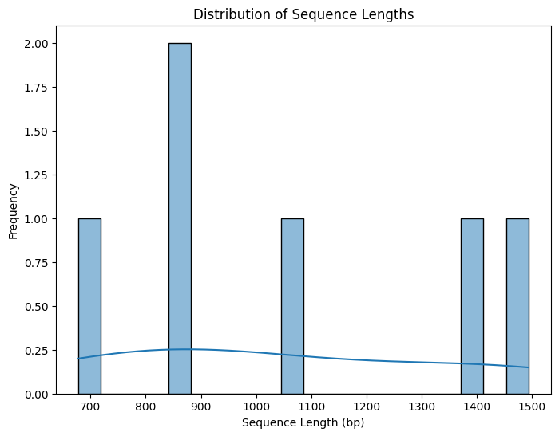
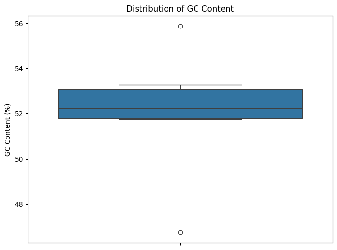
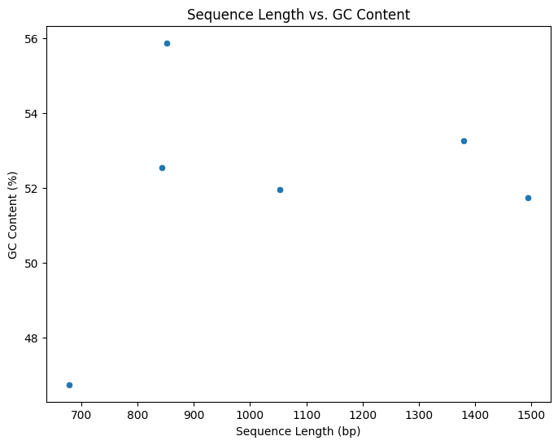
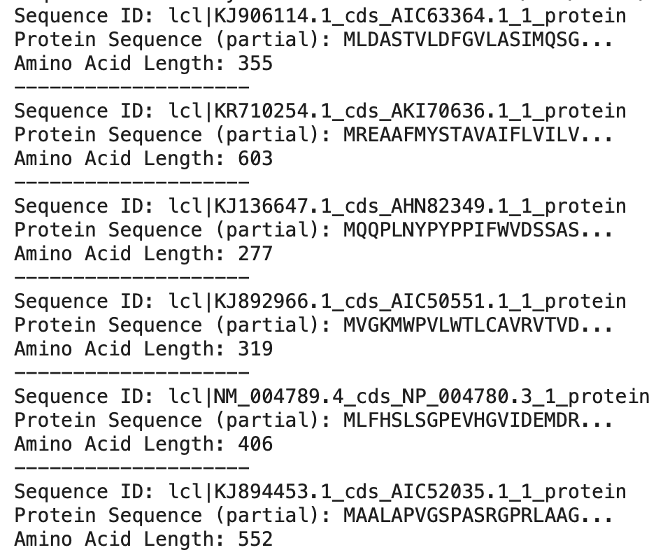
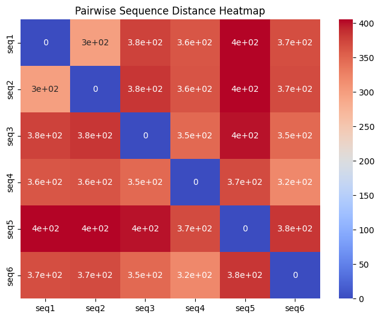
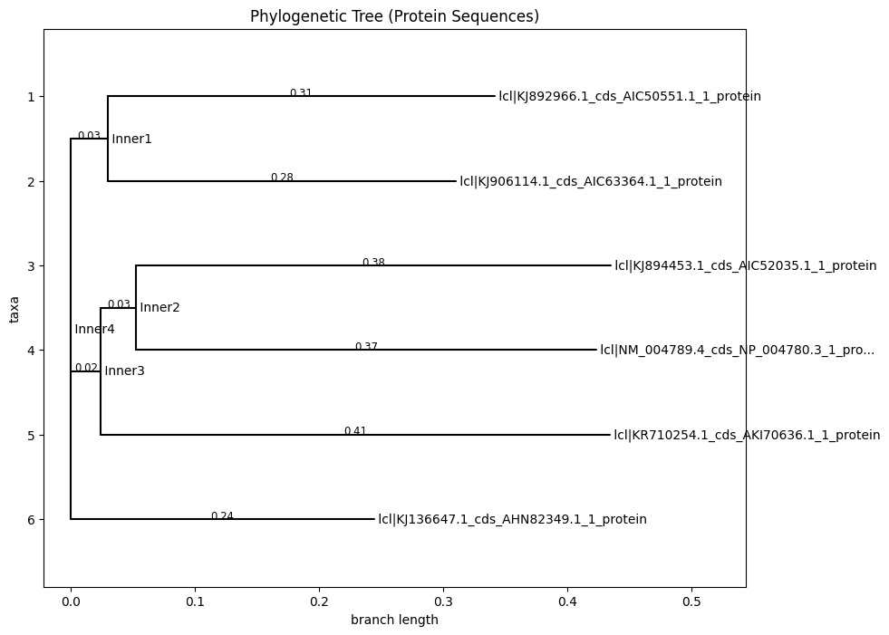

# Tutorial

The easiest way to use this pipeline is to run it in a Google Colab notebook. You can do so by using the "Open in Colab" button in the readme.md file.

### Load the sequences and install dependencies

```
!pip install biopython
from Bio import SeqIO
sequences = list(SeqIO.parse("sequences.fna", "fasta"))
```
This code installs BioPython, imports the SeqIO module, and loads all sequences from a FASTA file (sequences.fna) into a list of SeqRecord objects. Each SeqRecord contains sequence data and metadata like ID and description.

### Calculate sequence length and GC content

```
# Histogram of Sequence Lengths
plt.figure(figsize=(8, 6))
sns.histplot(sequence_df["Length"], bins=20, kde=True)
plt.title("Distribution of Sequence Lengths")
plt.xlabel("Sequence Length (bp)")
plt.ylabel("Frequency")
plt.show()

# Boxplot of GC Content
plt.figure(figsize=(8, 6))
sns.boxplot(y=sequence_df["GC Content"])
plt.title("Distribution of GC Content")
plt.ylabel("GC Content (%)")
plt.show()

# Scatterplot: Length vs. GC Content
plt.figure(figsize=(8, 6))
sns.scatterplot(x="Length", y="GC Content", data=sequence_df)
plt.title("Sequence Length vs. GC Content")
plt.xlabel("Sequence Length (bp)")
plt.ylabel("GC Content (%)")
plt.show()
```

Sequence length and GC content are calculated and plotted.





### Protein sequence prediction
This code iterates through protein records, displaying:

- Sequence identifier
- First 20 amino acids of the sequence
- Total sequence length
```
for protein_record in protein_records:
    print(f"Sequence ID: {protein_record.id}")
    print(f"Protein Sequence (partial): {protein_record.seq[:20]}...")  # Print first 20 amino acids
    print(f"Amino Acid Length: {len(protein_record.seq)}")
    print("-" * 20)  # Separator
```


### Align sequences with Clustal
The code performs multiple sequence alignment using Clustal Omega, a widely-used alignment tool known for its accuracy and efficiency.
```
clustalomega_cline_nucleotide = ClustalOmegaCommandline(
    cmd=clustalo_path,
    infile="nucleotide_sequences.fasta",
    outfile="nucleotide_sequence_alignment.fna",  # Output file for nucleotide alignment
    verbose=True,
    auto=True,
    force=True
)
clustalomega_cline_nucleotide()
```
### Generate a pairwise sequence heatmap
The cpde then generates a pairwise sequence similarity heatmap to visualize the relationships between sequences.


### Create a phylogenetic tree
Based on the multiple sequence alignment, we construct a phylogenetic tree to infer evolutionary relationships.


### Perform BLAST searches
To identify homologous sequences in public databases, we perform BLAST (Basic Local Alignment Search Tool) searches against the NCBI non-redundant (nr) protein database.
```
# Step 2: Perform BLAST Search for Each Sequence
for seq_id, sequence in protein_sequences.items():
    print(f"Running BLAST for {seq_id}...")
    result_handle = NCBIWWW.qblast("blastp", "nr", sequence)  # BLASTP against NCBI nr database
    with open(f"{seq_id}_blast.xml", "w") as out_file:
        out_file.write(result_handle.read())  # Save results to XML
    time.sleep(2)  # Avoid spamming NCBI servers
```

